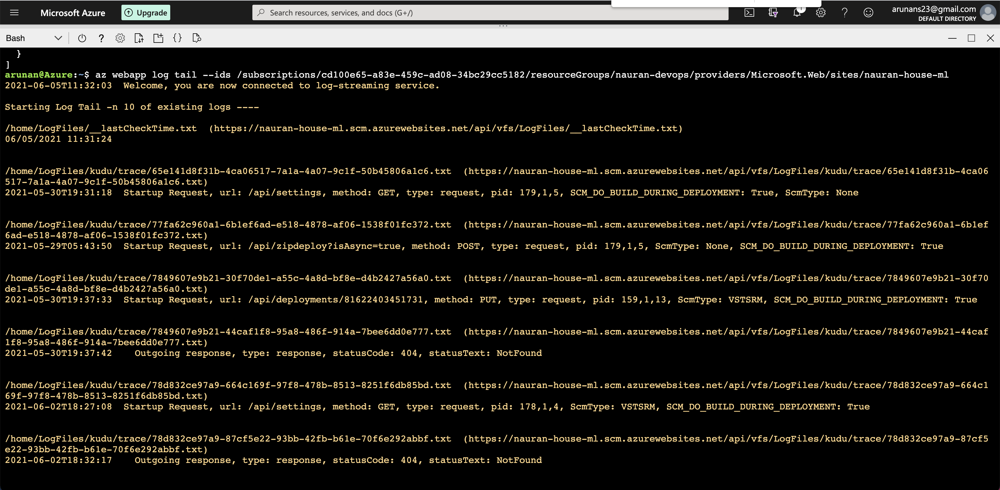

# Overview

 

This project aims to create a simple house price predicting service in Azure. To facilitate Agile Development, an end to end CI/CD (Continuous Integration and Continuous Development) deployment has been created with Azure Devops Pipelines.

## Architectural Diagram

## Project Plan

* [Trello Board](https://trello.com/b/q6d0VH5i/house-price-predict-ml-project)
* [Project Management plan](https://github.com/arunans23/house-price-predict-webapp/blob/main/ml-project-management-Q3-2021.xlsx)

## Instructions

* Clone the Project into Azure Cloud shell

    * Create a SSH pair inside Azure Cloud shell `ssh-keygen -t rsa`

    * Add the Public key to [Github](https://docs.github.com/en/github/authenticating-to-github/connecting-to-github-with-ssh/adding-a-new-ssh-key-to-your-github-account).

    * Clone the project `git@github.com:arunans23/house-price-predict-webapp.git`

        

* Running project on Azure App Service

    * Run `az webapp up -n nauran-house-ml -g nauran-devops --location eastus --sku F1`;

    * It will take some time for the deployment. Once the deployment is complete, you can view the homepage from the displayed URL:

        

        

    * Update [make_predict_azure_app.sh](make_predict_azure_app.sh) to have the webapp name `nauran-house-ml` in the POST target line

* Create virtual environment

    * Run: `python3 -m venv ~/.myrepo` so that the virtual environment directory is located at `~/.myrepo`

    * Activate the created virtual environment by: `source ~/.myrepo/bin/activate` or `. ~/.myrepo/bin/activate`

* You can run the tests by running the command `make all` which will run all the steps in the `Makefile`.

    

* Output of a test run

    * Run: `./make_predict_azure_app.sh`

        

* Load testing using Locust

    * Create a virtual environment like: `python3 -m venv .locust`

    * Activate the created virtual environment by: `source .locust/bin/activate` or `. .locust/bin/activate`

    * Run `pip install wheel` to let the command `bdist_wheel` be available

    * Run `pip install locust` to install `locust`

    * Run `locust`

    * Open browser and go to [http://localhost:8089/](http://localhost:8089/)

        

        

* Run Git actions

    * Git action workflow is found [here](https://github.com/arunans23/house-price-predict-webapp/blob/main/.github/workflows/pythonapp.yml).

    

* Follow the official [documentation](https://docs.microsoft.com/en-us/azure/devops/pipelines/ecosystems/python-webapp?view=azure-devops) to setup the CI/CD pipeline in Azure.

    * Azure pipeline configuration file is found [here](./azure-pipelines.yml)

* Running Azure App Service from Azure Pipelines automatic deployment

    

    

    

    

* Successful prediction from deployed flask app in Azure Cloud Shell using the [template](./make_predict_azure_app.sh)

    * Run the prediction script `./make_predict_azure_app.sh` after the webapp is online.

        

* Output of streamed log files from deployed application

    * Listing the application: `az webapp list` and note the ID

    * Start live log tracing for a webapp by:

        `az webapp log tail --ids /subscriptions/cd100e65-a83e-459c-ad08-34bc29cc5182/resourceGroups/nauran-devops/providers/Microsoft.Web/sites/nauran-house-ml`

        
